- [Módulo 1](#módulo-1)
  - [Software Enterprise](#software-enterprise)
    - [Ecossistema Enterprise](#ecossistema-enterprise)
    - [Principais características de um Sistema Enterprise](#principais-características-de-um-sistema-enterprise)
  - [Solution Architecture](#solution-architecture)
    - [Perfil da pessoa arquiteta de solução](#perfil-da-pessoa-arquiteta-de-solução)
    - [Soft Skills](#soft-skills)
    - [Principios para arquitetar uma solução](#principios-para-arquitetar-uma-solução)
    - [Iniciando com TCO (Total Cost of Ownership)](#iniciando-com-tco-total-cost-of-ownership)
    - [Aprofundando com TCO](#aprofundando-com-tco)
    - [Enterprise Architecture vs Solution Architecture](#enterprise-architecture-vs-solution-architecture)
    - [Três níveis de arquitetura de solução](#três-níveis-de-arquitetura-de-solução)
    - [Domínio, contextos e linguagem](#domínio-contextos-e-linguagem)
    - [Lei de Conway](#lei-de-conway)
    - [View e Viewpoints](#view-e-viewpoints)
    - [4 + 1](#4--1)
    - [Risco vs Documentação](#risco-vs-documentação)
  - [Design Patterns](#design-patterns)
    - [N tier / N layered architecture (Arquitetura baseada em camadas)](#n-tier--n-layered-architecture-arquitetura-baseada-em-camadas)
    - [Multi-tenant architecture](#multi-tenant-architecture)
    - [Stateless vs Stateful](#stateless-vs-stateful)
      - [Stateful](#stateful)
      - [Stateless](#stateless)
    - [Serverless](#serverless)
    - [Microsserviços](#microsserviços)
      - [Microsserviços vs Complexidades](#microsserviços-vs-complexidades)
    - [CQRS (Command Query Responsibility Segregation)](#cqrs-command-query-responsibility-segregation)
      - [Command Stack](#command-stack)
      - [Query Stack](#query-stack)
      - [CQS (Command Query Separation)](#cqs-command-query-separation)
    - [Caching](#caching)
      - [Estratégias de invalidacão do cache](#estratégias-de-invalidacão-do-cache)
    - [Distributed Lock](#distributed-lock)
    - [Configuration](#configuration)
    - [Secret Management](#secret-management)
    - [Circuit Breaker](#circuit-breaker)
    - [Sequencing](#sequencing)
    - [API Gateway](#api-gateway)
    - [Event Driven Architecture](#event-driven-architecture)
    - [Publish-Subscribe](#publish-subscribe)
    - [BFF (Backend for Frontend)](#bff-backend-for-frontend)
    - [Sidecar Applications](#sidecar-applications)
    - [Service Mesh](#service-mesh)
      - [Istio](#istio)
  - [AWS Well-Architected Framework](#aws-well-architected-framework)
    - [Arquitetura de Solução para Cloud](#arquitetura-de-solução-para-cloud)
    - [Conceitos](#conceitos)
      - [Excelência Operacional](#excelência-operacional)
        - [Princípios](#princípios)
      - [Segurança](#segurança)
        - [Princípios](#princípios-1)
      - [Confiabilidade](#confiabilidade)
        - [Princípios](#princípios-2)
      - [Eficiência e performance](#eficiência-e-performance)
        - [Princípios](#princípios-3)
      - [Otimização de custos](#otimização-de-custos)
        - [Princípios](#princípios-4)
      - [Sustentabilidade](#sustentabilidade)
        - [Princípios](#princípios-5)
    - [Princípios gerais](#princípios-gerais)
    - [10 princípios para aplicações Azure](#10-princípios-para-aplicações-azure)
  - [Observabilidade](#observabilidade)
    - [Observabilidade vs Monitoramento](#observabilidade-vs-monitoramento)
    - [Pilares vs Pipes](#pilares-vs-pipes)
    - [Ferramentas populares](#ferramentas-populares)
    - [OTEL (Open Telemetry)](#otel-open-telemetry)
  - [On-Premise vs Cloud vs Modelo Híbrido](#on-premise-vs-cloud-vs-modelo-híbrido)
    - [Modelo On-Premise](#modelo-on-premise)
    - [Modelo Cloud Computing](#modelo-cloud-computing)
    - [Modelo Cloud Híbrido](#modelo-cloud-híbrido)
  - [Soluções Cloud Native](#soluções-cloud-native)
  - [CNCF (Cloud Native Computing Foundation)](#cncf-cloud-native-computing-foundation)
  - [SAD (Solution Architecture Document)](#sad-solution-architecture-document)
    - [Tópicos tratados](#tópicos-tratados)

## Módulo 1

### Software Enterprise

- Grande empresa ou uma unidade de negócios de uma grande empresa
- Agência de governo ou uma unidade de uma agência governamental
- Multinacional que engloba diferentes tipos de negócio
- Pequenas e médias empresas que operam de forma global

#### Ecossistema Enterprise

O software faz parte do ecossistema, ele não trabalha sozinho.

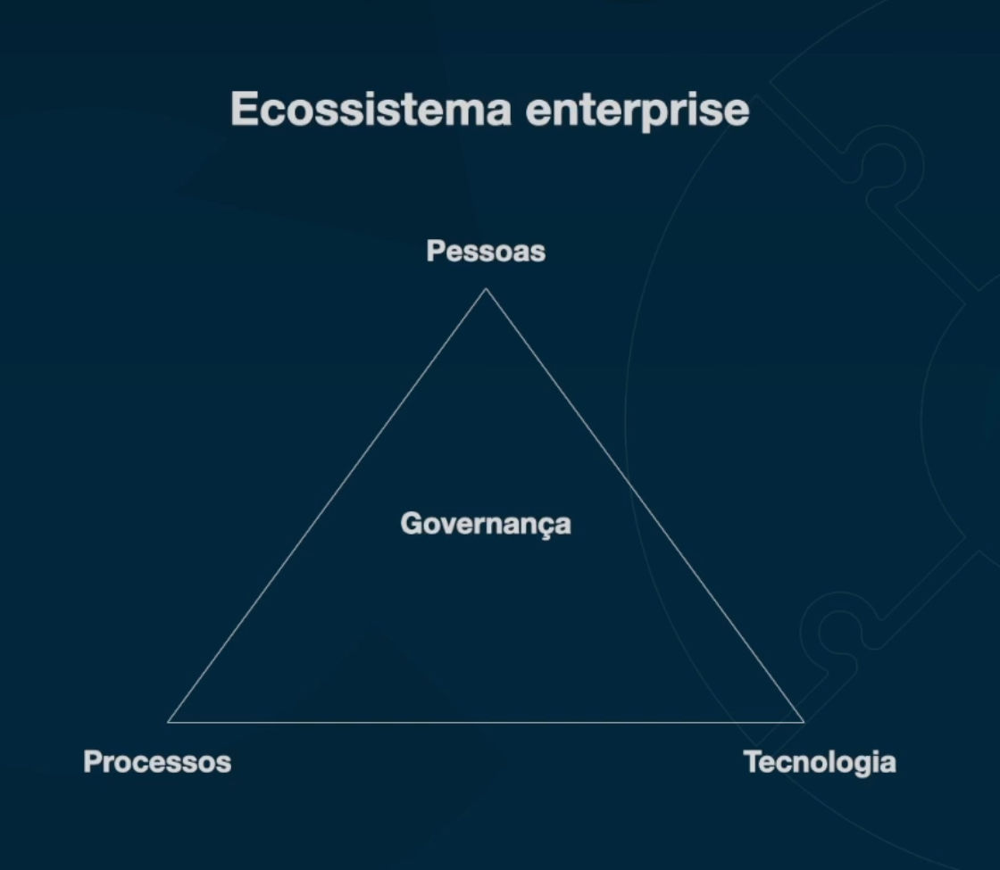

A tarefa da **governança**: sempre olhar para como é que a tecnologia vai fazer com que os processos funcionem com que as pessoas consigam trabalhar.

As pessoas tem que ter processos claros, esses processos geralmente são mapeadas dentro do software -> **Enterprise Software**

Como arquitetos de solução, somos responsáveis por olhar essa tríade pensando na governança, garantindo: restrições de negócio, restrições de regulamentação, restrições de pessoal e de orçamento.

#### Principais características de um Sistema Enterprise

O arquiteto de solução não está pensando apenas na parte técnica, ele tem que pensar no negócio, ele tem que entender o contexto da empresa, o contexto do mercado. Além disso, ele tem que pensar em que pensar também em como manter essa solução funcionando, operável e garantindo que vai trazer valor para a empresa.

Independente do software, todos os Software Enterprise têm **características em comum**:

- **Escalabilidade**

Um software escálavel é capaz de manter a sua mesma capacidade de operação, independente da quantidade de pessoas e sistemas que vão fazer parte de todo esse Ecossistema Enterprise.

>**Exemplo**: mantendo o tempo de resposta de 100ms.

- **Disponibilidade**

Disponibilidade e conseguir deixar um sistema no ar para todo mundo usar a qualquer momento. Para manter um sistema disponível, a primeira coisa que é preciso entender é o **custo**. Outro ponto é a **estratégia**, porque existem diversas formas de manter um sistema disponível. O objetivo é **manter a eficiência operacional com o menor custo, garantindo que todo mundo possa acessar o sistema**.

Disponibilidade não é apenas um sistema rodando no ar, mas sim, a **funcionalidade que aquele sistema tem, que você consegue utilizar no momento que você quer**. É preciso alinhar os **trade offs**, entender a empresa, entender o que realmente é **prioridade**, o que dá para fazer **em segundo plano** e o que no final do dia, vai estar disponível para utilizar. Portanto, é melhor pensar em disponibilidade não apenas como máquina funcionando, mas sim, **a funcionalidade que você precisa naquele momento**. Em Sistemas Enterprise, isso é algo que não é simples, são decisões **estratégicas** que, inclusive, não somente um arquiteto de solução, um arquiteto de software, etc, vai poder tomar sozinho.

- **Segurança**

Segurança de dados, segurança operacional, segurança em autenticação, autorização de pessoas que vão ter acesso ao sistema, segurança de rede e compartilhamento de informação

**O que você sabe, o que você tem e o que você é?**  O que eu sei? Eu sei uma senha. O que eu tenho? Eu tenho um pendrive e este pendrive garante que eu estou autenticado. E o que eu sou? Eu tenho uma digital ainda para confirmar um terceiro passo de uma transação extremamente complexa.

- **Customização e Modularização**

No Sistema Enterprise, esse sistema vai ter que ser **customizado** para conseguir garantir a eficiência operacional. Mas, ao mesmo tempo, ele normalmente é **modularizado** por departamentos ou por necessidades específicas do negócio.

O mercado hoje em dia consegue fazer com que você consiga adaptar e customizar ao máximo o software das grandes corporações.

- **Integração**

Pequenos softwares geralmente não tem necessidade de integração.

Trabalho de integração é o mais comum no ambiente enterprise.

**3 pontos principais para pensar:**
1. Os sistemas que eu estou desenvolvendo conseguem se falar?
2. Os sistemas que eu estou desenvolvendo conseguem falar com sistemas de terceiros que foram desenvolvidos fora de casa?
3. Os sistemas de terceiros que você vai contratar como parte da solução em si, tem a capacidade de ser integrada de forma eficiente, com **custo baixo** e com os **sistemas atuais** da sua companhia?

- **Observabilidade**

Uma das partes **mais importantes** falando em qualquer Ecossistema Enterprise, porque é preciso garantir que tanto os seus como os sistemas dos terceiros estão funcionando.

 - Acompanhamento de **métricas** no momento que deu problema com ajuda dos **logs**
- Acompanhamento em tempo real da performance do sistema

A performance não é somente ver como o sistema está performando em relação a aguentar throughput e a latência. Mas, ao mesmo tempo, ser capaz de **rastrear o caminho da informação por dentro dos sistemas**. E, baseado nesse caminho, conseguir garantir o comportamento desse dado durante o caminho depois de passar por diversos sistemas.

### Solution Architecture

**A Arquitetura de solução faz parte de um processo de definição de estrutura, componentes, módulos, interfaces de uma solução de software para satisfazer requisitos funcionais e não funcionais, bem como o seu comportamento.**

- O que o sistema exige para o seu funcionamento?
- Como que esse sistema escala?
- Como ele é hospedado?
- Como é feito um deploy?
- Como funciona a parte de persistência?
- Como que esse sistema vai escalar e descalar?

Arquitetura de solução define/sugere as stacks de tecnologia, plataformas, ferramentas e infraestrutura que serão utilizados para implementar a solução.

O arquiteto de solução tem uma visão bem alto nível do que a aplicação vai fazer, como vai fazer e qual é o mapa da solução para os outros stakeholders (desenvolvedores, arquitetos etc.)conseguirem trabalhar.

Normalmente, softwares menores e de utilizações mais simples, raramente precisam de um arquiteto, muitas vezes um dev que tem uma experiência maior no domínio do problema que vai resolver pé suficiente. Agora, para um sistema que tem que ter **performance, escala, segurança, estabilidade, disponibilidade e tudo mais**, tem que ter uma visão mais ***high level***, porque inclusive, esses sistemas se integram com outros. Portanto, eles geram impacto diretamente em toda a organização se você estiver criando um software dessa forma.

#### Perfil da pessoa arquiteta de solução

Normalmente, uma pessoa arquiteta de solução não necessariamente tem que ser uma pessoa somente técnica. O arquiteto de solução, já tem bagagem em diversos tipos de domínio.

O arquiteto de solução tem conhecimento de diversas tecnologias de acordo com experiências anteriores.

A pessoa arquiteta de solução consegue levar em consideração o contexto, as restrições de negócio, aspectos operacionais, custos e toda a parte técnica.

É uma pessoa que **conhece o negócio com essa tecnologia e conhece a empresa**.

Portanto, o arquiteto tem a visão **do todo, ele entende do negócio, da tecnologia e das restrições que o negócio tem**. E o grande ponto aqui é que a pessoa arquiteta de solução tem que estar preparada para entregar soluções complexas para ambientes enterprise. Porque raramente vai ter um arquiteto de solução trabalhando em um sistema extremamente simples. Um ambiente enterprise, é um ambiente extremamente **crítico**, um ambiente que possui **diversos tipos de integração, diversos tipos de tecnologia com diversos tipos de cultura** dentro da mesma organização. Então, o arquiteto de solução tem que estar habituado com esse tipo de coisa.

#### Soft Skills

- Saber se adaptar em diversos tipos de projetos e contextos
- Ter maturidade emocional para conseguir fazer essa mudança
- Comunicação
- Uma pessoa que, indiretamente ou eventualmente diretamente, se torna um líder
- Uma pessoa que as pessoas podem confiar
- Pensamento estratégico ***(como que isso aqui vai durar ao longo do tempo? Quando que isso vai se pagar? Se a gente for para essa linha, o que vai acontecer?)***
- Criatividade
- Inteligência emocional
- Saber trabalhar em equipe
- Temos que saber ouvir

#### Principios para arquitetar uma solução

- Alinhamento com objetivos do negócio e com o usuário final
- Flexibilidade
- Reusabilidade
  > O que já existe? Como que eu aproveito isso?
- Interoperabilidade

  > Como outros sistemas vão se comunicar com esse sistema ou como esse sistema vai conseguir se comunicar com outros sistemas, mesmo que não precise no momento de desenvolvimento
- Mantenabilidade

  > Desde corrigir um simples bug até conseguir fazer um deploy rápido, eficiente, para conseguir resolver o problema no ar. Ou até mesmo, quando o sistema cair do ar, como que eu vou conseguir já ter um plano B para eu conseguir subir isso o mais rápido possível?
- Regras regulatórias
- Portabilidade
    > Muitas vezes um sistema ou uma solução que você vai estar fazendo, vai ser absorvida por outro sistema, ou o sistema que você fez vai absorver esse outro sistema. As informações, elas têm que estar disponíveis facilmente.

#### Iniciando com TCO (Total Cost of Ownership)

>“Uma boa arquitetura de solução abrange os casos de usos de negócio, a solução técnica e os serviços de infraestrutura subjacentes como componentes separados. Ele também pode ser usado para calcular o custo de propriedade TCO (Total Cost of Ownership) do sistema, para que os gestores da empresa possam entender o impacto financeiro da solução.”

*Fernando, Chanaka. Solution Architecture Patterns for Enterprise (p.54)*

**TCO não é somente o custo que vai ter para desenvolver a solução, mas também manter - corrigir, atualizar e criar novos recursos**

#### Aprofundando com TCO

> Uma métrica financeira que representa o custo total de comprar, desenvolver e operar uma solução ao longo do tempo.

Às vezes a solução que você está querendo desenvolver já existe no mercado e ela tem um preço.

O TCO pode estar na parte de desenvolvimento, mas também na compra de soluções prontas. E não somente a compra - a operação do negócio precisa de servidor, pessoas para dar suporte para o usuário final, suporte para o desenvolvedor e é preciso da infraestrutura. O que essa infraestrutura vai precisar? Eu vou precisar ter observabilidade nesse sistema para garantir que está tudo funcionando e eu posso confiar.

**Quando estamos falando em formato de custo, estamos falando do custo de aquisição, implementação, manutenção, operação e inativação.**

>**Operação**: garantir esse negócio funcionando de forma estável

> **Manutenção**: manter a solução no dia a dia

> **Inativação**: export de dados, quebras de contrato, as máquinas, os bancos de dados

#### Enterprise Architecture vs Solution Architecture

> **Enterprise Architecture**: possui uma visão da corporação como um todo. A Enterprise Architecture trabalha na parte do planejamento e implementação da estrutura organizacional da corporação, incluindo pessoas, processos e tecnologia.

> **Solution Architecture**: define a estrutura, características, comportamentos e relações entre um sistema específico.

A Solution Architecture está embaixo de uma Solução Enterprise que vai ser um guarda chuva que vai nortear todas as soluções que vão acontecer durante todo o processo de desenvolvimento.

#### Três níveis de arquitetura de solução

1. Arquitetura focada no negócio **(Nível 0)**

   > Como que eu vou entender o problema que eu vou resolver? O que é possível? O que não é possível? Quais são os módulos que eu vou ter que trabalhar? Quais são as decisões? Quais são requisitos funcionais, não funcionais? Como que aquilo vai funcionar na empresa? Quantas pessoas vão utilizar esse sistema?

    - ##### Nível 0 - Visão

    >A visão deixa claro os objetivos da solução de uma forma mais empírica, lógica e que deixe claro a razão de existir. A visão vai definir os principais objetivos que vão guiar a solução.

    >A visão apresenta uma visão de alto nível do que a solução vai realizar, suas necessidades, bem como todos os envolvidos.

    - ##### Nível 0 - Escopo

    >O escopo vai definir os limites ***(boundaries)*** da solução: os contextos, os limites, é até onde a solução vai, até onde a solução não vai, o que vai ser feito e acima disso, o que a solução não vai entregar.

    >Vai definir exatamente o problema que vai ser resolvido, os requisitos funcionais e não funcionais, e quais são os componentes, sistemas e tecnologias que essa solução vai utilizar. Também vai considerar as restrições e os pressupostos que podem influenciar no design da solução.

    >Assim, quando temos a visão e o escopo do projeto, é a partir daí vamos começar a entender o negócio, entender o motivo que o negócio funciona e quando isso tudo estiver definido, aí sim vamos para o nosso **nível 1 - solução técnica**.

2. Arquitetura focada na área técnica **(Nível 1)**

   > Como que eu consigo trazer aquilo que a gente pensou e que o negócio precisa para um plano de ação técnico? Ou seja, como isso vai ser desenvolvido? Quais as tecnologias que vão trabalhar? Como é que vão funcionar as integrações? Quanto esse negócio vai custar? Quanto desenvolvedores eu vou precisar? Quais soluções que nós vamos ter que desenvolver? O que a gente vai integrar, o que não vamos integrar, etc.
3. Arquitetura focada no Deployment **(Nível 2)**

   >Focada na infraestrutura que você vai utilizar aquela solução técnica que já foi criada. A infraestrutura que esse negócio vai rodar, como ele vai rodar, como é que vai ser as esteiras que nós vamos trabalhar, como que a gente garante a parte de qualidade de testes etc.

#### Domínio, contextos e linguagem

**Domínio** - o problema que você quer resolver

Trabalhando em Sistemas Enterprise, você tem que ter um conhecimento aprofundado do negócio e também tem que conseguir olhar o negócio pelo ponto de vista dos seus participantes, por exemplo: um vendedor, um parceiro de diferentes departamentos etc.

Linguagem é um aspecto muito importante, porque uma organização tem diversas áreas, tem diversos departamentos e tem diversos tipos de pessoas com culturas diferentes em países diferentes, com culturas absurdamente plurais.

**Dica: criar um glossário por area, por tipos de stakeholders**. Vai servir como um dicionário para entender como é que cada pessoa se comunica, inclusive, na hora de fazer integrações de sistemas entre essas áreas.

#### Lei de Conway

> “A lei de Conway é um princípio que afirma que o design de um sistema é influenciado pela estrutura organizacional do grupo que o produz. Isso significa que a estrutura de comunicação de um grupo será refletida na estrutura do sistemas que eles criam. A arquitetura de um sistema reflete os limites sociais do grupo que o criou.”

A estrutura organizacional da empresa vai influenciar diretamente na estrutura de design de um sistema.

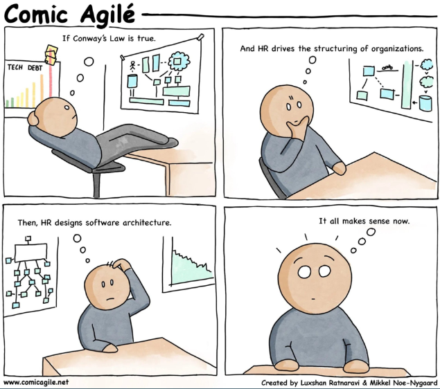

#### View e Viewpoints

**View**:
> “Uma visão é uma representação de um ou mais aspectos estruturais de uma arquitetura que ilustra como a arquitetura aborda uma ou mais questões mantidas por um ou mais de seus stakeholders”

**Viewpoint**:
> “Um ponto de vista é uma coleção de padrões, modelos e convenções para construir um tipo de visão. Ela define as partes interessadas cuja as preocupações são refletidas no ponto de vista e nas diretrizes, princípios e templates para a construção de seu ponto de vista”

####  4 + 1

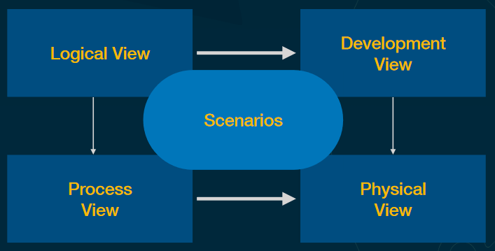

*P. Kruchten Architectural Blueprints - The "4+1" View Model of Software Architecture*

####  Risco vs Documentação

O risco vai ser totalmente proporcional à quantidade de documentações e formalizações que vai ser preciso fazer em determinada solução.

**Refleções importantes:** reflita e utilize muito o bom senso em relação aos pontos de vista que você vai levantar, os riscos que isso tem em relação à organização como um todo. Até que ponto isso vale uma documentação? Até que ponto isso vale uma documentação com detalhes e mais detalhes? Tudo isso depende do risco.

### Design Patterns

>Soluções comuns para diversos tipos de problema, ou seja, existem diversos problemas que já foram resolvidos por muitas pessoas. E, essas pessoas, normalmente resolveram de uma forma comum.

#### N tier / N layered architecture (Arquitetura baseada em camadas)

>Criação das camadas separadas para uma aplicação.

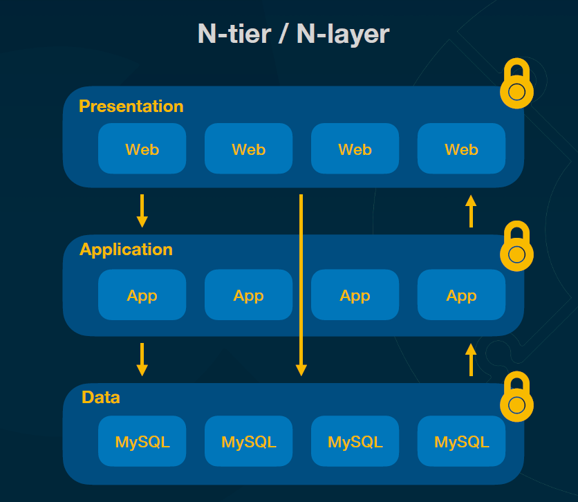

- Presentation
  > Layer que vai focar em apresentação. Essa parte de exibição é desacoplada da parte das outras áreas da aplicação

- Application
  > Vai rodar as regras de negócio, as orquestrações dos processos etc.

- Data

Esses três layers funcionam de forma independentes. Além disso, cada um tem as suas permissões de acesso diferentes, as suas regras de segurança diferentes. Então, por exemplo, a parte de apresentação pode estar totalmente disponível para a internet, mas a parte de aplicação é banco de dados e fica para dentro de uma sub rede que não tem acesso direto a internet.

> Coisa comum com esse tipo de arquitetura: **a comunicação ponto a ponto**

> Quando a parte de web precisa de alguma coisa, ela bate na parte de **aplicação** e a aplicação, eventualmente, se ela precisar pegar algum dado, ela vai pegar esses dados **do banco de dados**. Logo, o banco de dados provavelmente vai retornar isso aí para minha aplicação e vai retornar isso para a parte de web. Quando o fluxo dessa aplicação funciona dessa forma, normalmente a gente chama de **Closed Ring**. O que isso significa? Significa que a parte de apresentação não vai bater direto lá no banco de dados, ela **sempre tem que passar pelos layers da minha aplicação**.

> **Outro approach**: eventualmente pode fazer com que você dê um bypass em uma camada e acesse uma camada diretamente. Então, por exemplo, aqui quando estamos trabalhando de forma open, significa que a minha apresentação, eventualmente, poderia consultar o meu banco de dados diretamente.

> Não existe certo e errado!

> **Boas práticas: passar por todos os layers**

#### Multi-tenant architecture

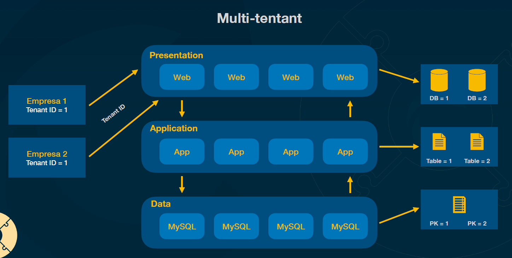

Não necessariamente precisa estar utilizando uma arquitetura baseada em camadas quando falamos da arquitetura multi-tenant.

O sistema pode ter, entre aspas, diversos inquilinos, ou seja, diversos usuários que fazem parte de organizações diferentes.

Os tenants acessam, geram transações e armazenam dados. Mas esses dados não podem ser vistos ou compartilhados entre os tenants. Cada tenant vê apenas os seus dados. Isso é muito comum quando estamos trabalhando com a plataforma SaaS de Software as a Service.

**Approaches de armazenamento de dados:**

- uma única aplicação, mas na hora de salvar os dados, dois bancos de dados esão sendo criados, um banco para o tenant 1 e um banco para o tenant 2
- tabelas diferentes
- única tabela com uma chave primária composta pelo ID do tenant **(a solução mais comum**)

A decisão vai depender muito da quantidade de dados, do tamanho de cada empresa etc.

#### Stateless vs Stateful

**Vai determinar se você vai poder escalar ou não a sua aplicação!**

##### Stateful

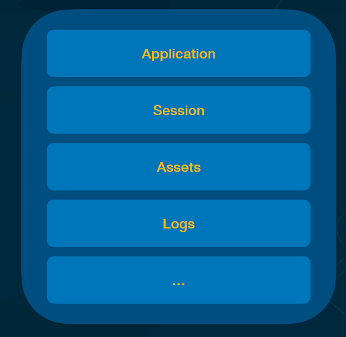

As informações das seções do usuário, outros dados do usuário ficam armazenadas nessa mesma aplicação. E, se essa aplicação morrer e a gente criar uma outra, os dados do usuário são perdidos junto.

##### Stateless

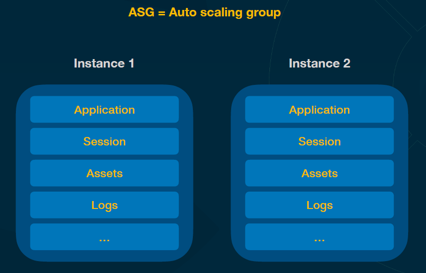

Ao invés de armazenar o estado dentro da própria aplicação, eu posso:
- deixar os dados da sessão gravadas em um banco de dados
- subir os assets no Amazon S3
- salvar os logs gerados num banco de dados separado

Então, quando a instância morrer, nada vai estar perdido.

#### Serverless

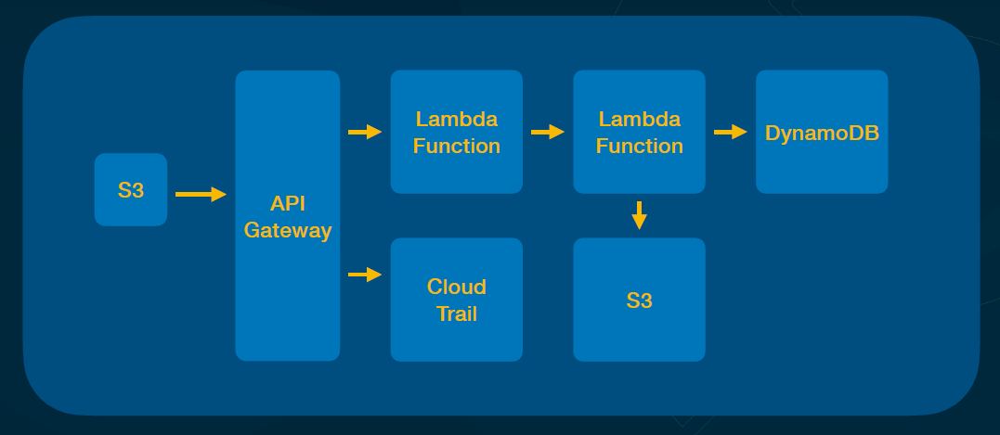

Serverless é um conceito geral de serviços que incluem diversas opções quando você está trabalhando com Cloud Providers.

> Principal característica: pagar somente pelo que eu realmente uso, somente pela minha demanda

Serverless não necessariamente é uma Lambda Function.

> Quando estamos falando em Serverless, não estamos falando apenas em Lambda Functions. Serverless ignifica que eu não vou ter que me preocupar com dimensionamento de infraestrutura, deployment de infraestrutura e pagar por algo que eu não estou utilizando. Significa que o Cloud Provider vai provisionar e deixar tudo pronto para mim e ele vai me cobrar on demand conforme o uso. Logo, Serverless vai desde o S3 até uma Lambda Function, até um banco de dados.

#### Microsserviços

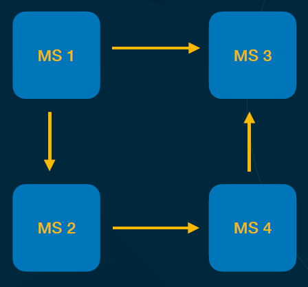

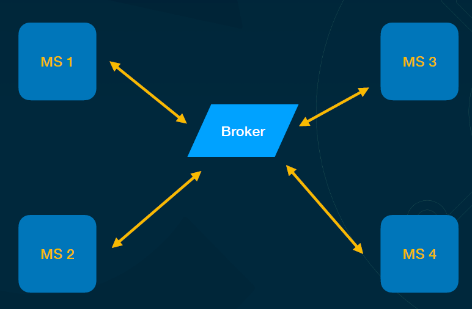

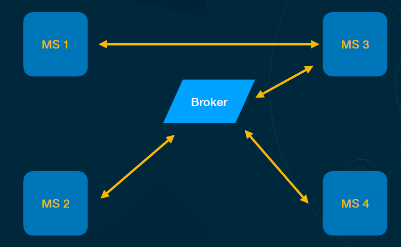

Microsserviços são sistemas que normalmente têm responsabilidades específicas e essas responsabilidades podem ser projetos totalmente diferentes dentro de uma organização.

Alguns projetos podem ter relacionamento entre eles, então, pode acontecer que um microsserviço tenha que chamar outros microsserviços diretamente.

**Vantagem**: separando isso tudo, fica mais fácil inclusive organizacionalmente criar diversas equipes

**Desvantagem**: quando um microsserviço chama o outro e o outro estiver fora do ar, o microsserviço que chamou também vai ficar fora do ar e isso pode gerar um efeito dominó muito grande dentro da organização.

> A coisa mais importante que temos que fazer quando nós trabalhamos com microsserviços é **lutar contra o acoplamento**.

Como?

1. Bancos de dados

  > Se os microsserviços compartilham o mesmo banco de dados, significa que se um microsserviço encher um banco de dados de acessos e deixar este banco de dados lento, o outro microsserviço que vai utilizar esse banco de dados também vai ficar lento. Se alguém mudar uma coluna inadvertidamente de um microsserviço vai quebrar um outro microsserviço.

**É muito comum nós ter um banco de dados por microsserviço**.

2. Trabalho de forma asíncrona

   > Ao invés de um microsserviço chamar o outro diretamente, eles vão se falar através de mensagens, através de eventos. Dessa forma, o Microsserviço 1 fala: “Olha, compra realizada, os dados do cartão estão aí”, e o Microsserviço 2 pega os eventos de compra realizada e fala: “Compra aprovada, já fiz o pagamento do cartão”. Daí ele manda falando da compra aprovada, Aí o microsserviço 4 fala: “vou gerar nota fiscal da compra aprovada”, e ele retorna “nota fiscal emitida”. Então o microsserviço 3 fala: “Opa! Com a nota fiscal emitida eu vou permitir que o caminhão saia para fazer entrega.

   > Um microsserviço não falou diretamente com o outro.

   > Se um microsserviço cair, os outros microsserviços vão continuar funcionando normalmente. E quando ele subir, ele vai processar as mensagens pendentes que ele tinha.

**A principal motivação para utilizar os microsserviços nos dias de hoje é organizacional e equipe.**

Outro ponto: **escalabilidade**

> Se uma área de um único sistema tiver muitos acessos, o sistema inteiro vai ter que ser escalado. Com microsserviços, eu escalo somente o microsserviço que está tendo muito acesso. Se eu tenho um único sistema, por melhor que ele esteja arquitetado, vai ter tanta responsabilidade no mesmo sistema que uma coisa vai começar a afetar outra, invariavelmente. Então, quando você tem microsserviços, você consegue criar diversos microsserviços para diversas responsabilidades.

**Também: Tecnologias diferentes para soluções diferentes**

##### Microsserviços vs Complexidades

- Maturidade de organização

  > As gestões das equipes vão ser diferentes, a gestão dos projetos vão ser diferentes e a forma de você conseguir disponibilizar esses ambientes para os desenvolvedores vai ser diferente.

- Maturidade dos times
  > Os times têm que ser mais maduros, porque cada time tem que se especializar naquele domínio que aquele microsserviço vai resolver. Aquele time tem que conseguir entender outras formas de comunicação, porque eles não vão trabalhar mais só como o Rest, ficar chamando APIs, eles vão ter que trabalhar com mensageria, vão ter que trabalhar com eventos.

  > Outra coisa que vai acontecer é que eles não vão ter todos os dados, porque o banco de dados é separado.

- Relatórios de dados que não estão totalmente no meu microsserviço

- Deployment
  > n esteiras de CI/CD rodando, n pods diferentes

- Observabilidade

- Troubleshooting

#### CQRS (Command Query Responsibility Segregation)

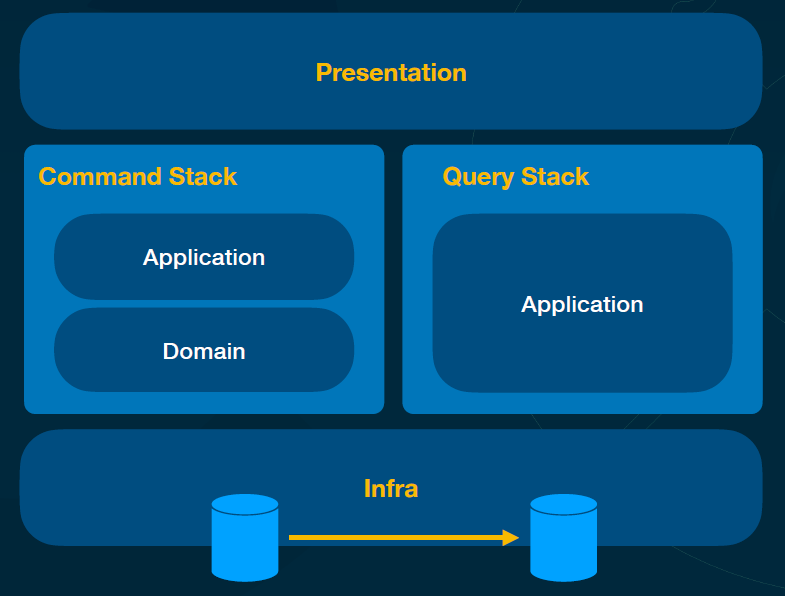

##### Command Stack

> Uma camada, uma área da aplicação onde tem apenas mudanças de estado (criação de um usuário, alteração de um email etc.) e a área de domínio.

A apresentação recebe essa informação, bate na aplicação, roda regras de domínio, acessa o banco de dados e acabou.

Nesse ponto, quando eu crio alguma coisa, eu não vou retornar algo em troca. Assim, na hora que eu crio um comando, eu apenas executo o comando e acabou.

Se der algo errado, retorna apenas uma simples Exception.

Essa área do sistema serve **apenas para gravação**.

##### Query Stack

> Apenas a camada da aplicação.

Essa área do sistema serve **apenas para leitura**.

Uma opção interessante é separar os bancos de dados para escrita e para leitura que vão estar sincronizados.

##### CQS (Command Query Separation)

O conceito anterior de conseguir fazer alguns tipos de separação, por exemplo, tudo o que é ação, não retorna nada.

#### Caching

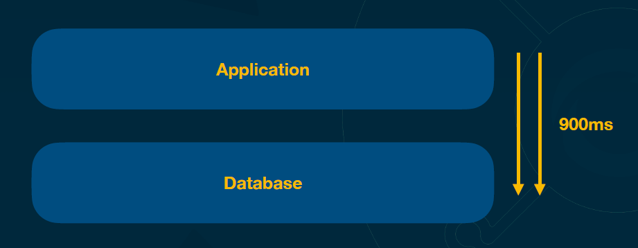

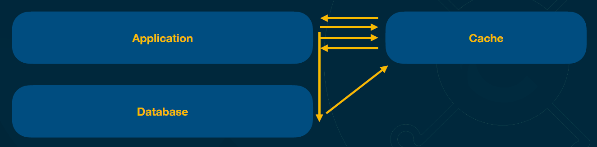

Normalmente o cache é um sistema à parte e normalmente é um banco de dados que guarda as coisas em memória para ter um acesso muito rápido. Mas, às vezes o próprio cache pode ser guardado em um banco de dados.

A parte um pouquinho mais complexa em relação ao cache é a parte de **invalidação**, porque invariavelmente, aqueles dados que guardamos no cache vão mudar.

##### Estratégias de invalidacão do cache

O objetivo é manter o máximo possível na consistência dos dados.

- Time-based invalidation
- Least Recently Used (LRU)
  > D *

  > C

  > B

  > A - vai ser removido para o D poder entrar

- Most Recently Used (MRU)
  > C * - versão modificada do C

  > C - vai ser removido para o C* poder entrar

- Least Frequently Used (LFU)
  > D - 10

  > C - 5 - vai ser removido como o dado com o menor número de acessos

  > B - 6

  > A - 7

- TTL-based invalidation (time-to-live)

- Write-through invalidation
  > Sempre quando há alteração no disco, o cache é atualizado em conjunto. Essa estratégia funciona bem com sistema que não possuem um alto índice de escrita.

- Write-back invalidation
  > Quando há alteração, o cache primeiramente é atualizado e depois o dado em disco é atualizado. Muitas vezes o dado em disco é atualizado quando o cache já está para expirar de alguma forma.

#### Distributed Lock

Muitas vezes o maior problema, o maior desafio está na concorrência ***(exemplo: vender um único produto para duas pessoas)***.

> O lock distribuído vai ser uma forma de bloquear um registro, bloquear uma operação caso duas pessoas, dois sistemas, duas requisições tentem alterar ao mesmo tempo independente da quantidade de máquinas que estejam rodando.

- Consistência de dados
- Contenção de recursos
- Evita dead locks
- Garante mais eficiência dos recursos
- Ferramentas: Apache Zookeeper, ETCD (bd do Kubernetes), Redis, Consul

Exemplo do lock/unlock em TypeScript utilizando Zookeper:

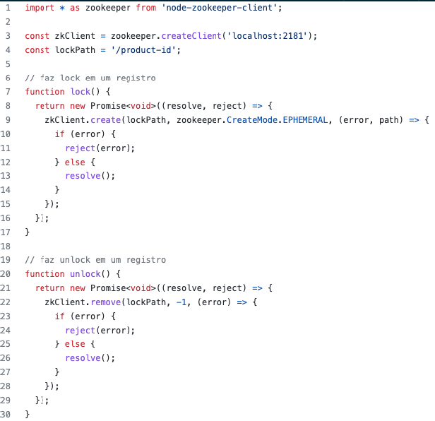

#### Configuration

> Vai ajudar a mudar em tempo de execução, as configurações do software

- Configurações de uma aplicação mudam a qualquer momento
- Como mudar uma senha de banco de dados, credenciais de email, etc.. Sem ter que reiniciar totalmente a aplicação ou refazer o deploy?

**Opção 1:** refazer o deploy gastando o tempo desnecessário e eventualmente deixando a aplicação fora do ar

**Opção 2:** guardar as configurações nas variáveis de ambiente ou num arquivo .env, tendo que rebootar a aplicação para aplicar as alterações nas variáveis, deixando a aplicação fora do ar

**Opção 3: Configuration.** Criaçõ de um endpoint, por exemplo /configuration que vai receber as configurações, e depois de receber uma requisição, dar um boot somente naquelas configurações. Além do HTTP pode estar sendo usada uma fila, e toda vez que chegar uma mensagem nessa fila, as variáveis serão recarregadas.

#### Secret Management

- Credenciais não podem ficar “voando" na empresa
- Processos para rotacional credenciais são importantes
- Serviços gerenciados e soluções ajudam nessa tarefa
  - Hashicorp Vault
  - AWS Secret Manager
    - Armazenamento de secrets
    - Rotacionamento automáticos de secrets nos serviços como RDS
    - SDK para recuperação dos secrets em tempo de execução

#### Circuit Breaker

> Funciona como disjuntor de energia.

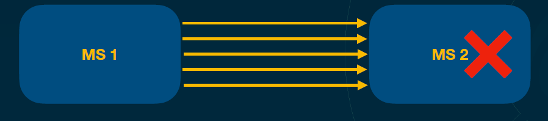

Com uma grande carga o Microsserviço 2 vai ficar lento, deixando o Microsserviço 1 lento também, gerando **efeito dominô**.

Com Circuit Breaker, ele vai quebrar o canal de comunicação entre MS 1 e MS2 quando o MS2 começar a ficar lento. Assim, na próxima requisiçao do MS1 para MS2 ele já vai receber um erro 500, ou qualquer outro tipo de erro. Então, **o MS1 vê que o MS2 está indisponível e segue a vida dele.**

**Estados de microsserviços**:

- Fechado

  > Mantém a comunicação entre os dois microsserviços e está tudo funcionando.

- Aberto

  > Quando o MS1 vai mandar uma mensagem para o MS2, ele não consegue estabelecer a comunicação ou o MS2 fala: “Não vou receber mais nenhuma requisição”, e daí o MS1 toca a vida.

- Meio aberto

  > Se o MS2 ficou fora do ar e abriu o circuito, como que o MS1 sabe que ele já está pronto novamente para receber a requisição? O MS1 manda uma requisição, vê se responde, não respondeu, beleza, passa um tempinho, manda mais uma requisição e o MS2 falou: “tô ok”. Logo, o MS1 manda mais um “tá ok” e mandam mais um “tá ok”. E daí ele fala: “opa, o cara tá no ar”. Assim, ele continua mandando todas as requisições de uma vez.

**Formas de trabalhar com o Circuit Breaker**:

- No microsserviço que está recebendo a requisição

  > Pode colocar um proxy na frente, pode colocar algumas regras, que na hora que você está mandando a requisição, o MS2 para de atender essas requisições.

- No MS1

  > Você manda um grande número de requisição e o microsserviço não está respondendo, então você para de mandar aquela requisição, espera e manda de novo para ver.

#### Sequencing

Resolve o problema de eventualmente gerar IDs repetidos, que pode ser um grande problema para as grandes empresas como, por exemplo, Mercado Livre com 26.000 microsserviços, e toda hora esse microsserviços estão gerando IDs.

> Esse serviço tem o seu banco de dados, ele consegue trabalhar de forma atômica, ele evita qualquer tipo de concorrência que vai gerar IDs repetidos e ele tem que ser extremamente performático. Ele vai guardar os IDs gerados,os nome dos MS e o momento em qual o ID foi gerado.

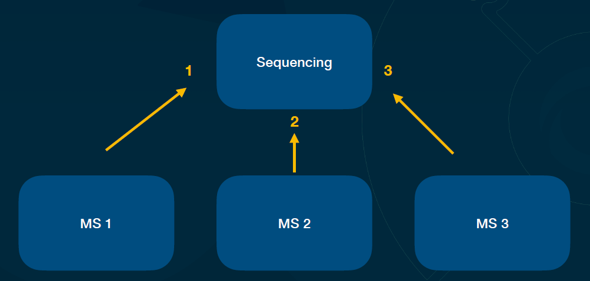

#### API Gateway

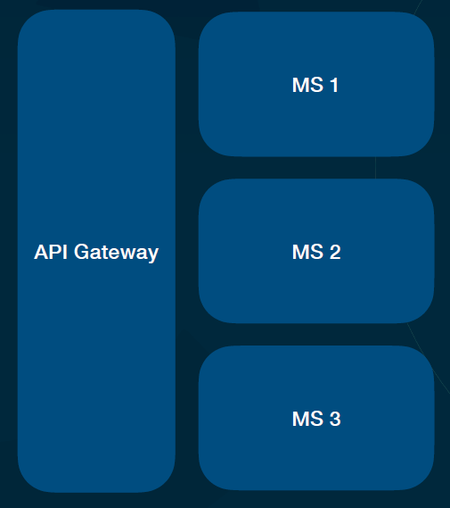

- Centralizador de requisições
- Roteamento
- Autenticação
- Conversão de dados
- Cabeçalhos
- Throttling
- Rate Limit

AWS, Mulesoft, Sensedia, Kong (Open Source)

#### Event Driven Architecture

- Evento acontecem no passado
  - Event Notification
  > Serve para notificar que alguma coisa aconteceu, depois disso, esse evento não serve para mais nada.
  - Event Carried State Transfer
  > Traz os dados completos do evento
  - Event Sourcing
  > Grava tudo que acontece, todas as mudanças de estado dos eventos que acontecem no seu sistema em um banco de dados.
- Um evento emitido pode ser o gatilho de entrada para um outro sistema
- Coreografia vs Orquestração

#### Publish-Subscribe

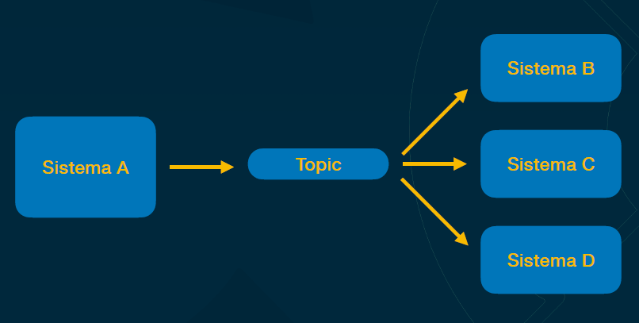

#### BFF (Backend for Frontend)

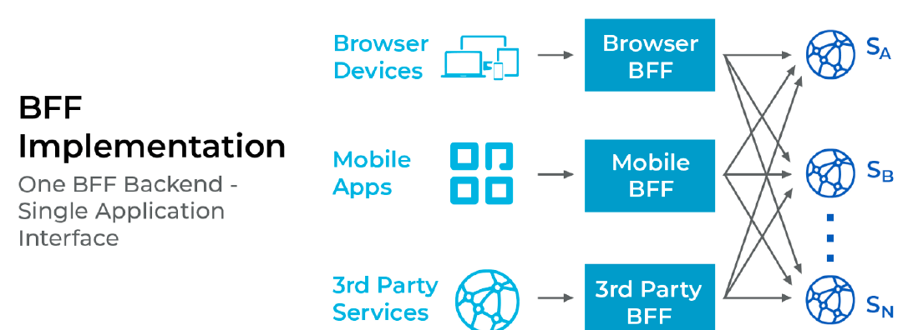

#### Sidecar Applications

- Aplicações auxiliares na aplicação principal
- Coleta de logs
- mTLS
- Controle de tráfego

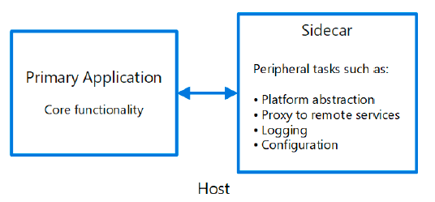

#### Service Mesh

> "Uma malha de serviço é uma camada de infraestrutura dedicada que você pode adicionar as
suas aplicações. Ele permite adicionar recursos de forma transparente, como observabilidade,
gerenciamento de tráfego e segurança, sem adicioná-los ao seu próprio código".

##### Istio

- Gerenciamento de tráfego
- Segurança
- Policy enforcement
- Observabilidade
- Extensibilidade

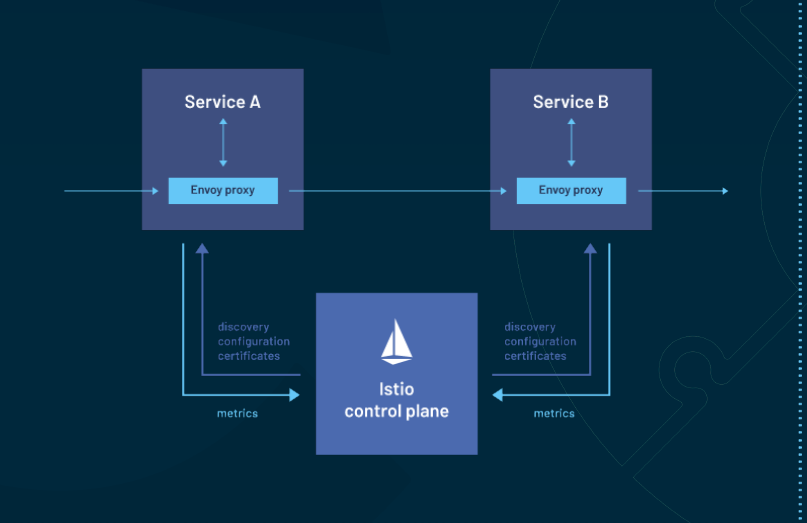

### AWS Well-Architected Framework

#### Arquitetura de Solução para Cloud

- AWS Well-Architected
- Framework de boas práticas
  - Excelência Operacional
  - Segurança
  - Confiabilidade
  - Eficiência e performance
  - Otimização de custos
  - Sustentabilidade

#### Conceitos

##### Excelência Operacional

> A capacidade de oferecer suporte ao desenvolvimento e executar cargas de trabalho com eficiência, obter informações sobre suas operações e melhorar continuamente os processos e procedimentos de suporte para agregar valor aos negócios.

###### Princípios

- Execute operações como código (IaC)
- Faça mudanças frequentes, pequenas e reversíveis
- Refine os procedimentos de operações com frequência
- Antecipe falhas
- Aprenda com todas as falhas operacionais

##### Segurança

> O pilar de segurança descreve como aproveitar as vantagens das tecnologias de nuvem para proteger dados, sistemas e ativos de uma forma que possa melhorar sua postura de segurança.

###### Princípios

- Implemente uma base de "identity" forte
- Rastreabilidade
- Ative todos os layers de segurança
- Proteja os dados em trânsito e os armazenados
- Mantenha pessoas longe dos dados
- Prepare-se para eventos de segurança

##### Confiabilidade

> O pilar de confiabilidade abrange a capacidade de uma carga de trabalho de executar sua função pretendida de forma correta e consistente quando é esperado. Isso inclui a capacidade de operar e testar a carga de trabalho durante todo o seu ciclo de vida.

###### Princípios

- Recupere-se automaticamente de falhas
- Teste procedimentos de recuperação
- Escale horizontalmente para aumentar a disponibilidade de carga de trabalho agregada
- Pare de adivinhar a capacidade
- Gerencie a mudança de forma automatizada

##### Eficiência e performance

> A capacidade de usar recursos de computação com eficiência para atender aos requisitos do sistema e manter essa eficiência à medida que a demanda muda e as tecnologias evoluem.

###### Princípios

- Democratizar tecnologias avançadas
- Torne-se global em minutos
- Use arquiteturas serverless
- Experimente com mais frequência
- "Consider mechanical sympathy"

##### Otimização de custos

> A capacidade de executar sistemas para fornecer valor de negócios ao preço mais baixo = conseguir fazer mais gastando menos.

O custo sempre vai estar ligado com o benefício que a tal tecnologia retorna.

###### Princípios

- Implemente o Cloud Finance Management
- Adote um modelo de consumo
- Meça a eficiência geral
- Pare de gastar dinheiro em trabalhos que não geram diferenciais competitivos
- Analise e atribua despesas

##### Sustentabilidade

> A capacidade de melhorar continuamente os impactos da sustentabilidade, reduzindo o consumo de energia e aumentando a eficiência em todos os componentes de uma carga de trabalho, maximizando os benefícios dos recursos provisionados e  minimizando o total de recursos necessários.

###### Princípios

- Entenda seu impacto
- Estabeleça metas de sustentabilidade
- Maximizar a utilização
- Antecipe e adote novas ofertas de hardware e software mais eficientes
- Use serviços gerenciados (que já cuidem da sustentabilidade)
- Reduza o impacto downstream de suas cargas de trabalho na nuvem

#### Princípios gerais

- Pare de adivinhar suas necessidades de capacidade
- Sistemas de teste em escala de produção
- Automatize a experimentação arquitetônica
- Permitir arquiteturas evolutivas
- Guie sua arquitetura usando dados
- "Melhorar durante os dias de jogo” - Atualização continua

#### 10 princípios para aplicações Azure

- Design for self healing
- Deixa as coisas redundantes
- Minimize a coordenação
- Desenhe para escalar
- Particionamento
- Design for operations
- Use serviços gerenciados
- Use a melhor data storage para o melhor trabalho
- Design for evolution
- Construa para as necessidades do negócio

### Observabilidade

> Uma medida de quão bem os estados internos de um sistema podem ser inferidos a partir do conhecimento das saídas externas desse sistema. Simplificando, observabilidade é o quão bem você pode entender seu sistema complexo (baseado nos dados de saída).

> Na teoria de controle, a observabilidade é definida como uma medida de quão bem os estados internos de um sistema podem ser inferidos a partir do conhecimento das saídas externas desse sistema. Simplificando, observabilidade é quão bem você pode entender seu sistema complexo.

https://newrelic.com/blog/best-practices/what-is-observability

#### Observabilidade vs Monitoramento

- Monitoramento nos mostra que há algo errado
- Monitoramento se baseia em saber com antecedência quais sinais você deseja monitora ***(ex.: notificação toda vez que o uso de CPU fica mais de 80%)***
- Observabilidade nos permite perguntar **o porquê**

#### Pilares vs Pipes

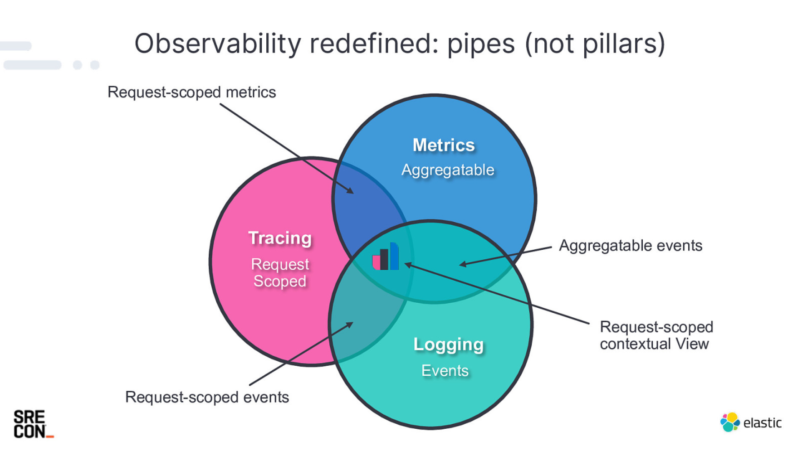

https://talks.riferrei.com/VRBRea/slides

- Metrics
  > Qualquer medida que você acaba tendo, dados que você consegue agregar (ex.: 30 compras por minuto, media de 60% de memória RAM etc.)
- Tracing
  > = rastreabilidade, permite que você veja o caminho de uma requisição dentro do sistema. Mas não somente o caminho, o escopo e o contexto, porque eventualmente eu posso ter diversas requests e cada request tem um pedido diferente.
- Logging
  > Informações completas sobre os eventos

  **Essas três áreas têm momentos em comum = PIPES**

Você não observa as coisas apenas de forma separada. Eu observo as coisas com os dados em conjunto.

#### Ferramentas populares

- Elastic Stack
  > Open Source. É coberto por Kibana, que é um dashboard com plugins. No Elastic Stack, no Elastic Search vamos utilizar a parte de observabilidade - Elastic APM (Application Performance Monitoring).
- Datadog
- New Relic
- Splunk
- Dynatrace
- Prometheus/Grafana*
  > Uma ferramenta para métricas, dados agregados, contadores e “histogramas”. O banco de dados que o Prometheus trabalha, é chamado de **data series**, database. Ele vai recebendo os dados, vai guardando os logs num formato de log baseado no tempo. Então, ele tem os intervalos. O Prometheus, a cada tantos segundos, você configura e ele acessa um endpoint da sua aplicação para pegar as informações e gerar essas métricas. O Prometheus trabalha com sistema de alarmes intelligentes. Junto com o Prometheus, normalmente você utiliza uma ferramenta chamada Grafana. Essa ferramenta ajuda a pegar os dados do Prometheus e gerar dashboards, e esses dashboards também podem conter alarmes.
- Jaeger*
  > O grande foco do Jaeger está na parte de tracing distribuído.
- Zipkin*
  > O sistema gera métricas e consegue enviar esses dados para o Zipkin em um determinado padrão. Então, o Zipkin tem um padrão de tracing. **As soluções na nuvem normalmente aceitam o padrão do Zipkin**.
- Kiali*
  > Ferramenta de tracing. A ideia do Kiali é conseguir fazer rastreabilidade e verificar a comunicação entre sistemas. O Kiali nasceu inicialmente para ser um sistema de rastreabilidade de um service mesh que se chama Istio. Então, o Kiali é instalado em cima do Istio e o Istio instalado em cima do Kubernetes, assim, você consegue ver os seus serviços se comunicando.

#### OTEL (Open Telemetry)

- CNCF Project
- Baseado no Open Tracing e Open Census
- Baseado em:
  - Especificações
  - Protocolos
  - SDKs
  - Ferramentas de integração

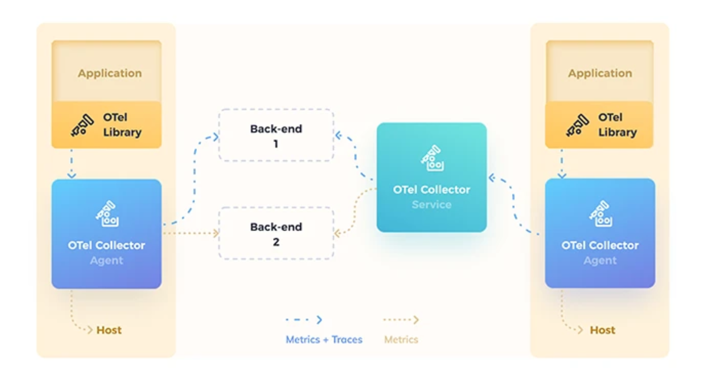

https://www.dynatrace.com/news/blog/what-is-opentelemetry-2/

### On-Premise vs Cloud vs Modelo Híbrido

#### Modelo On-Premise

-  Softwares são instalado localmente na empresa ou em um datacenter
-  Custo inicial é alto
-  Hardware possui depreciação
-  Hardware exige manutenção
-  Precisa de profissionais qualificados com conhecimentos em hardware, rede, software, virtualização, etc.
-  Escalabilidade complexa
-  Alta disponibilidade complexa (rodar em mais datacenters, fisicamente distantes, ao mesmo tempo)
-  Alto controle sobre software, hardware, protocolos de segurança etc.
-  Altamente customizável
-  Acesso físico por profissionais da empresa
-  Hardware normalmente é mais barato e poderoso do que máquinas - adrão que rodam na cloud
-  Controle dos dados
-  Integração com sistemas legados
-  Compliance e regulações (Armazenamento, PCI DSS, HIPPA - Health Care))
-  Custos previsíveis
-  Sem lock-in
-  Se bem dimensionado, o custo inicial se paga ao longo dos anos
-  A longo prazo, se bem dimensionado, o custo pode ser menor do que soluções em Cloud

#### Modelo Cloud Computing

- Baixo custo inicial
- Escalabilidade de forma simplificada
- Acessibilidade
- Alta disponibilidade (Regions e AZs)
- Custo com profissionais especializados em datacenter, rede,hardware, etc
- “Pay-as-you-go”: Pague conforme o uso
- Hardware exige manutenção
- Backups automatizados
- Serviços gerenciados
- Recuperação rápida em casos de desastres
- Amplitude de serviços

#### Modelo Cloud Híbrido

- Pode ser considerado um modelo de transição
- Modelo alternativo para ter mais controle de dados e serviços específicos, porém, com as vantagens da nuvem
- Redução de custos para grande utilização sazonal
- Integração de serviços pode ser complexa
- Latência pode ser um grande desafio
- Profissionais especializados em diversas áreas

### Soluções Cloud Native

- Soluções desenhadas para rodar em ambientes de Cloud Computing
- São desenhados para tirar vantagens desses ambientes
- Modulares
- Prontas para rodar de forma distribuída

Exemplo:
- Docker
- Kubernetes, Helm, Istio, Linkerd, Envoy
- Apache Kafka
- Prometheus
- OpenTelemetry
- AWS Lambda
- ArgoCD
- Produtos HashiCorp (Vault, Consul, Terraform)

### CNCF (Cloud Native Computing Foundation)

> "We bring together the world’s top developers, end users, and vendors and run the largest open
source developer conferences. CNCF is part of the nonprofit Linux Foundation."

https://www.cncf.io/about/who-we-are/

- Organização sem fins lucrativos
- 153 Projetos e contando
- Criada em 2015
- Parte da Linux Foundation
- Responsável por famosos projetos:
  - Kubernetes, Prometheus, OTEL, Envoy, Jaeger
- Programas de certificação
  - CKAD (Certified Kubernetes Application Developer)
  - CKD (Certified Kubernetes Administration)
  - CKS (Certified Kubernetes Security Specialist)
  - KCNA (Kubernetes an Cloud Native Associate)
  - PCA (Prometheus Certified Associate)

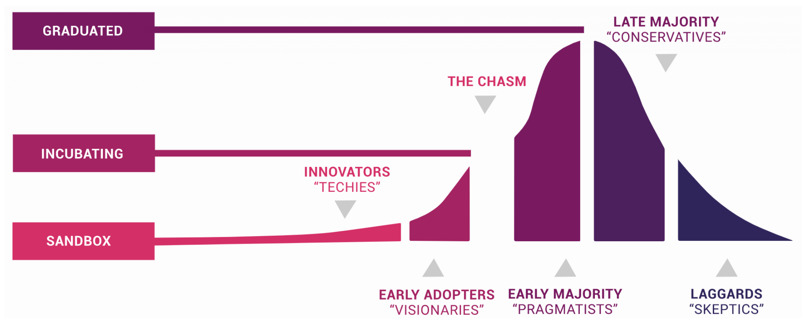

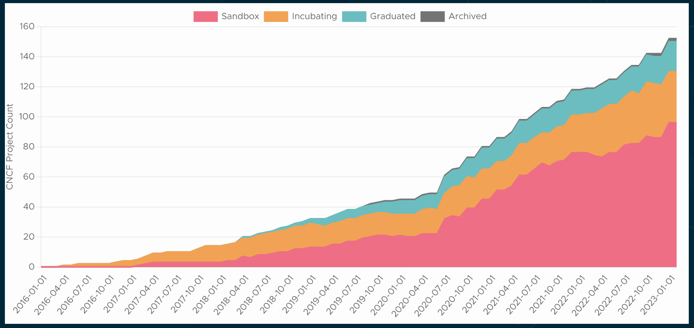

### SAD (Solution Architecture Document)

> Documento que descreve a arquitetura de uma solução

**Exemplos:**

[Exemplo 1](docx/SystemDesignDocument-Example1.docx)

[Exemplo 2](docx/SystemDesignDocument-Example2.docx)

**Trata-se normalmente de:**
- Componentes
- Módulos
- Interfaces
- Fluxo de Dados
- Leva em consideração o contexto do projeto
- É gerado na fase de planejamento do projeto
- Da clareza aos envolvidos sobre a solução como um todo
- Server de referência para os mais diversos tipos de stackholders
- Nem todo SAD possui a mesma estrutura
- Documentamos o que realmente importa!
- Quanto maior o risco do projeto > documentação

#### Tópicos tratados

- Introdução
  - Propósito do documento
  - Escopo da solução
  - Restrições
    > Linguagem de programação, prazos, financeiro, regulamentos governamentais etc.
  - Pressupostos (assumptions)
- Visão geral da arquitetura
  - Descritivo com principais pontos
  - Diagrama de alto nível
    > É recomendável seguir um padrão! Ex.: Modelo C4
  - Principais componentes
  - Diagramas de fluxo
- Requisitos
  - Funcionais
    - Recursos, funcionalidades, features que agregam valor ao negócio
  - Não funcionais
    - Ex: Performance, escalabilidade, segurança, disponibilidade + cross-cutting
- Design da arquitetura
  - Diagramas detalhados bem como sua descrição
  - Tecnologias a serem utilizadas
  - Integração entre sistemas
- Implementação
  - Metodologias de desenvolvimento e ferramentas
  - Processos de deployment e infraestrutura
  - Processos de teste e qualidade
- Operação e manutenção
  - Monitoramento
  - Processos de manutenção
  - Disaster recovery
  - Processo de gerenciamento de mudanças
- Riscos e estratégias de mitigação
  - Riscos potenciais
  - Riscos de grande impacto
  - Planos de contingência
- Custos, tecnologia e pessoal
  - Estimativa de custos para implementação
  - Recomendação de equipes e pessoal
- Próximos passos
  - Sugestão de ordem de execução
  - Observações gerais
