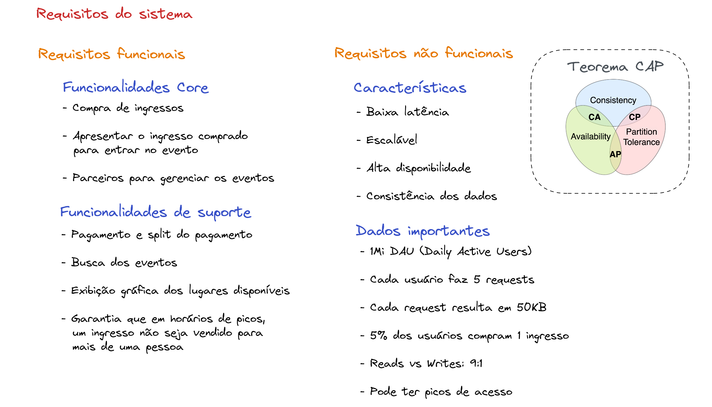

# Índice

- [Módulo 1](#modulo-1)
    - [Software Enterprise](#software-enterprise)
        - [Ecossistema Enterprise](#ecossistema-enterprise)
        - [Principais características de um Sistema Enterprise](#principais-caracteristicas-de-um-sistema-enterprise)
            - [Escalabilidade](#escalabilidade)
            - [Disponibilidade](#disponibilidade)
            - [Segurança](#seguranca)
            - [Customização e Modularização](#customizacao-e-modularizacao)
            - [Integração](#integracao)
            - [Observabilidade](#observabilidade)

## Módulo 1

### Software Enterprise

- Grande empresa ou uma unidade de negócios de uma grande empresa
- Agência de governo ou uma unidade de uma agência governamental
- Multinacional que engloba diferentes tipos de negócio
- Pequenas e médias empresas que operam de forma global

#### Ecossistema Enterprise

O software faz parte do ecossistema, ele não trabalha sozinho.

A tarefa da **governança**: sempre olhar para como é que a tecnologia vai fazer com que os processos funcionem com que as pessoas consigam trabalhar.

As pessoas tem que ter processos claros, esses processos geralmente são mapeadas dentro do software -> **Enterprise Software**

Como arquitetos de solução, somos responsáveis por olhar essa tríade pensando na governança, garantindo: restrições de negócio, restrições de regulamentação, restrições de pessoal e de orçamento.

#### Principais características de um Sistema Enterprise

O arquiteto de solução não está pensando apenas na parte técnica, ele tem que pensar no negócio, ele tem que entender o contexto da empresa, o contexto do mercado. Além disso, ele tem que pensar em que pensar também em como manter essa solução funcionando, operável e garantindo que vai trazer valor para a empresa.

Independente do software, todos os Software Enterprise têm **características em comum**:

- **Escalabilidade**

Um software escálavel é capaz de manter a sua mesma capacidade de operação, independente da quantidade de pessoas e sistemas que vão fazer parte de todo esse Ecossistema Enterprise.

>**Exemplo**: mantendo o tempo de resposta de 100ms.

- **Disponibilidade**

Disponibilidade e conseguir deixar um sistema no ar para todo mundo usar a qualquer momento. Para manter um sistema disponível, a primeira coisa que é preciso entender é o **custo**. Outro ponto é a **estratégia**, porque existem diversas formas de manter um sistema disponível. O objetivo é **manter a eficiência operacional com o menor custo, garantindo que todo mundo possa acessar o sistema**.

Disponibilidade não é apenas um sistema rodando no ar, mas sim, a **funcionalidade que aquele sistema tem, que você consegue utilizar no momento que você quer**. É preciso alinhar os **trade offs**, entender a empresa, entender o que realmente é **prioridade**, o que dá para fazer **em segundo plano** e o que no final do dia, vai estar disponível para utilizar. Portanto, é melhor pensar em disponibilidade não apenas como máquina funcionando, mas sim, **a funcionalidade que você precisa naquele momento**. Em Sistemas Enterprise, isso é algo que não é simples, são decisões **estratégicas** que, inclusive, não somente um arquiteto de solução, um arquiteto de software, etc, vai poder tomar sozinho.

- **Segurança**

Segurança de dados, segurança operacional, segurança em autenticação, autorização de pessoas que vão ter acesso ao sistema, segurança de rede e compartilhamento de informação

**O que você sabe, o que você tem e o que você é?**  O que eu sei? Eu sei uma senha. O que eu tenho? Eu tenho um pendrive e este pendrive garante que eu estou autenticado. E o que eu sou? Eu tenho uma digital ainda para confirmar um terceiro passo de uma transação extremamente complexa.

- **Customização e Modularização**

No Sistema Enterprise, esse sistema vai ter que ser **customizado** para conseguir garantir a eficiência operacional. Mas, ao mesmo tempo, ele normalmente é **modularizado** por departamentos ou por necessidades específicas do negócio.

O mercado hoje em dia consegue fazer com que você consiga adaptar e customizar ao máximo o software das grandes corporações.

- **Integração**

Pequenos softwares geralmente não tem necessidade de integração.

Trabalho de integração é o mais comum no ambiente enterprise.

**3 pontos principais para pensar:**
1. Os sistemas que eu estou desenvolvendo conseguem se falar?
2. Os sistemas que eu estou desenvolvendo conseguem falar com sistemas de terceiros que foram desenvolvidos fora de casa?
3. Os sistemas de terceiros que você vai contratar como parte da solução em si, tem a capacidade de ser integrada de forma eficiente, com **custo baixo** e com os **sistemas atuais** da sua companhia?

- **Observabilidade**

Uma das partes **mais importantes** falando em qualquer Ecossistema Enterprise, porque é preciso garantir que tanto os seus como os sistemas dos terceiros estão funcionando.

 - Acompanhamento de **métricas** no momento que deu problema com ajuda dos **logs**
- Acompanhamento em tempo real da performance do sistema

A performance não é somente ver como o sistema está performando em relação a aguentar throughput e a latência. Mas, ao mesmo tempo, ser capaz de **rastrear o caminho da informação por dentro dos sistemas**. E, baseado nesse caminho, conseguri garantir o comportamento desse dado durante o caminho depois de passar por diversos sistemas.
